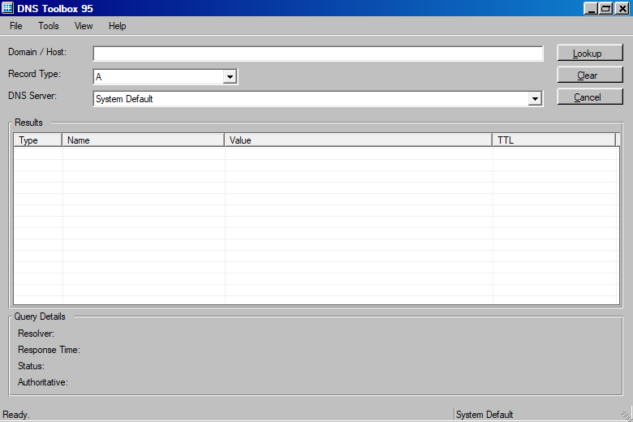
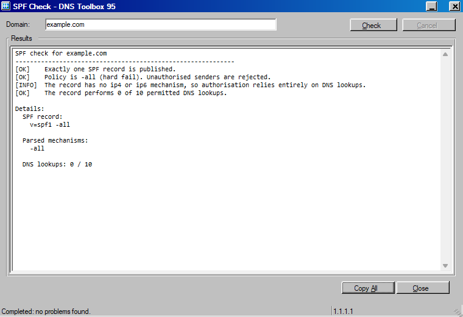
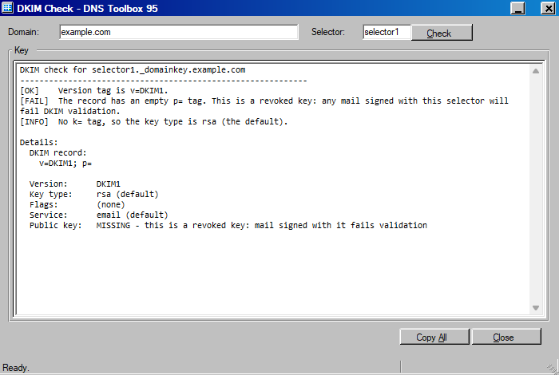
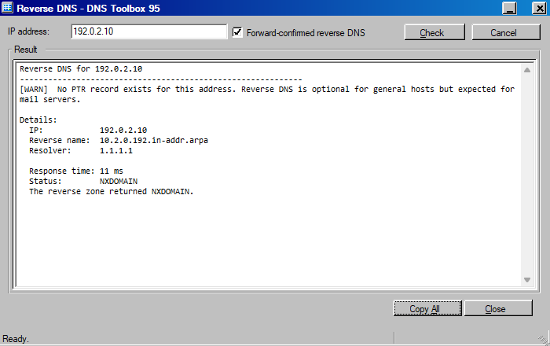
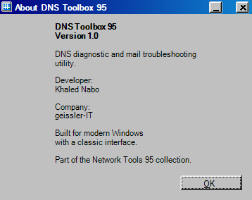

# DNS Toolbox 95

A DNS diagnostic and mail troubleshooting utility for sysadmins and network
administrators, in the style of a 1996 Windows administration tool.

It belongs to the same visual suite as **VlanConfig95**, but it is a completely
standalone application: nothing is shared with, referenced by, or loaded from that
project at run time.

Main window, with the query bar and the structured results table:



## Requirements

- Windows 10 or Windows 11
- .NET Framework 4.8 (present on current Windows by default)
- No administrator rights are needed. The application runs as the invoking user
  and only sends DNS queries.
- Network access to the resolvers you query

## Features

### Main query
Look up any record type against a chosen resolver:

`A` `AAAA` `CNAME` `MX` `TXT` `NS` `SOA` `PTR` `SRV` `CAA`

* The results table shows **structured** data, never raw command output.
  Columns adapt to the record type: priority for MX, priority/weight/port/target for
  SRV, and all seven SOA fields for SOA.
* Query details show the resolver, response time, DNS status and the
  authoritative flag.
* Resolvers: the system default, every DNS server Windows is configured with (shown
  with the adapter name), Cloudflare / Google / Quad9, or a custom IPv4 or IPv6
  address.
* PTR accepts an IP address directly and builds the reverse name for you.

### Tools

| Tool | What it checks |
|------|----------------|
| **SPF Check** | Finds and parses the SPF record, validates the policy, and counts the DNS lookups it performs (following `include`, `a`, `mx`, `exists` and `redirect` recursively, with cycle detection) against the RFC 7208 limit of 10. |
| **DMARC Check** | Reads `_dmarc.<domain>`, reports policy, subdomain policy, percentage, rua, ruf and alignment modes, and validates the record. `p=none` is described as monitoring, not as a fault. |
| **DKIM Check** | Reads `selector._domainkey.domain`, combines the multi-string TXT record, and reports version, key type, flags, service type and whether the key is present, empty (revoked) or malformed. |
| **Mail DNS Check** | The combined mail check: MX records, address resolution for every exchanger, reverse DNS for each address, NS, SPF and DMARC. |
| **Reverse DNS** | PTR for any IPv4 or IPv6 address, with forward-confirmed reverse DNS. |
| **DNSSEC Check** | Reports DS, DNSKEY and RRSIG with the DNSSEC OK bit set, and states plainly whether the resolver actually validated the chain or merely returned the records. |
| **Compare Resolvers** | Queries the same name against several resolvers and compares the answers. |
| **Propagation Check** | The same comparison across the public resolvers. It is described as a sample, not a scan of every resolver on the internet. |

Findings are marked `[OK]`, `[WARN]`, `[FAIL]` or `[INFO]`. The wording is
deliberately conservative: a monitoring-only DMARC policy or an absent PTR record is
reported as a fact, not exaggerated into a failure.

### Screenshots

SPF check, including the parsed record and the DNS lookup count:



DKIM check. The multi-string TXT record is combined before it is parsed, and an
empty `p=` is reported as a revoked key:



Reverse DNS with forward-confirmed reverse DNS:



About dialog:



> The screenshots were taken against `example.com` and the RFC 5737
> documentation address `192.0.2.10`, queried through the public resolver
> `1.1.1.1`. No local or customer data is shown.

### Other
* **File > Save Report...** writes a plain-text report, only when you choose where.
* **File > Copy Results** puts a readable summary on the clipboard.
* **View > Logging** toggles the optional log file. See *Privacy / Logging* below.

## Privacy / Logging

- Logging is **disabled by default**. When disabled, no log file or log directory
  is created.
- When enabled, the log is written to `%LOCALAPPDATA%\DnsToolbox95\dnstoolbox95.log`,
  and disabling it again deletes the file.
- Settings are stored per user in `%LOCALAPPDATA%\DnsToolbox95\settings.txt`.
- Query history is held in memory only and is never persisted.
- The application performs no telemetry and no update check. The only network
  traffic is the DNS query you ask for, sent to the resolver you select.

## Building

Needs only the .NET Framework compiler that ships with Windows. No Visual Studio,
no .NET SDK, no NuGet packages, and there are no third-party dependencies.

```powershell
powershell -ExecutionPolicy Bypass -File .\build.ps1
```

or `build.cmd`. The result is `build\DnsToolbox95.exe`.

To build with Visual Studio instead, open `DnsToolbox95.sln` and build
`src\DnsToolbox95.csproj`.

## How it works

The DNS engine is written from scratch against RFC 1035 (`src/Dns`):

* `DnsMessage` builds and decodes DNS wire messages, including name compression,
  EDNS0 (needed for long SPF records) and the DNSSEC OK bit.
* `DnsQueryService` sends queries over UDP and falls back to TCP when a reply comes
  back truncated. Every call has a timeout, so a dead resolver cannot freeze the
  window.
* System resolvers are read through `System.Net.NetworkInformation`.

Queries run on the thread pool with a cancellation token, and results are posted
back to the UI thread explicitly, so the window never blocks.

## Design notes

The interface is drawn entirely by hand: the navy gradient caption, the raised and
sunken 3D borders, the etched group boxes and the classic status bar are all
painted, so nothing from the Windows 10 or 11 theme leaks through.

It behaves like a modern application. Buttons, checkboxes, menu items, the caption
buttons and the dialog buttons all respond to a **single** click.

That last point needed a real fix rather than a copied assumption. WinForms only
synthesises a `Click` event from a mouse release for a *captioned* window. These
windows are borderless, where the base class raises nothing at all, so a control
that relied on the base would be completely dead. `ClassicMouse` turns off
`ControlStyles.UserMouse` and handles the two button messages directly, which gives
exactly one `Click` per physical press in every window style.

The application icon is embedded in the EXE and assigned to the real form, so the
same image appears in Explorer, the taskbar, Alt+Tab and the window caption.

## Developer

Khaled Nabo (geissler-IT)